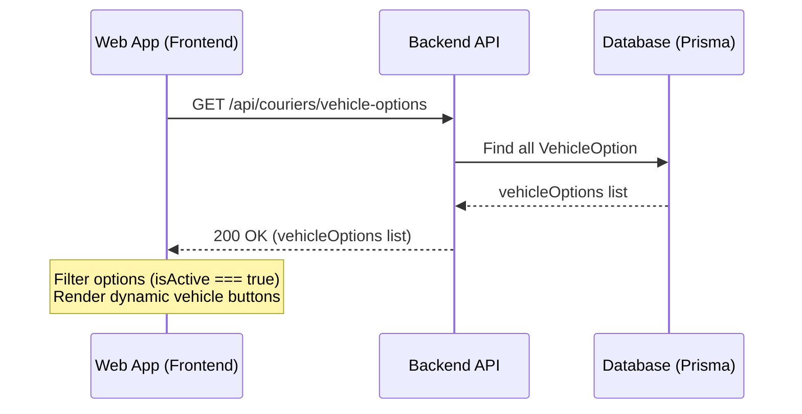

# Story 34: Dynamic Vehicle Options and Status Management

## 1. Problem Tanımı
Hoppa web uygulamasında, kurye başvuru formunda sunulan "Araç İstiyorum (Şirket Motosikleti)" seçeneğinin geçici olarak kapatılması istenmektedir. Ayrıca, bu ve diğer araç seçeneklerinin (Motosiklet, Araba, Bisiklet vb.) veritabanı (DB) üzerinden yönetilebilmesi, dinamik olarak getirilmesi ve aktif/pasif durumlarının DB'den kontrol edilebilmesi hedeflenmektedir.

## 2. Teknik Tasarım

### 2.1. Veritabanı Değişiklikleri (`schema.prisma`)
Yeni bir `VehicleOption` modeli oluşturulacaktır. Bu model araç tiplerini, çevirilerini ve aktif/pasif durumlarını içerecektir.

```prisma
model VehicleOption {
  id        String   @id @default(uuid())
  code      String   @unique // MOTORCYCLE, CAR, COMPANY_MOTORCYCLE, BICYCLE
  nameTr    String
  nameEn    String
  nameRu    String
  subTr     String?
  subEn     String?
  subRu     String?
  isActive  Boolean  @default(true)
  createdAt DateTime @default(now())
  updatedAt DateTime @updatedAt
}
```

### 2.2. Tohumlama (Database Seeding)
`backend/prisma/seed.ts` dosyasına `VehicleOption` verilerini tohumlayacak kodlar eklenecektir. "Araç İstiyorum" seçeneği (`COMPANY_MOTORCYCLE`) pasif (`isActive: false`) olarak tohumlanacaktır.

### 2.3. Backend API
`backend/src/routes/courierRoutes.ts` altına kamuya açık yeni bir rota eklenecektir:
* **Rota:** `GET /api/couriers/vehicle-options`
* **Controller:** `CourierController.getVehicleOptions`
* **Açıklama:** Veritabanındaki tüm `VehicleOption` kayıtlarını dönecektir.

### 2.4. Frontend (Next.js Web App)
* Sayfa yüklenirken `/api/couriers/vehicle-options` istek atılarak araç seçenekleri dinamik olarak yüklenecektir.
* Listelenen seçenekler arasından yalnızca `isActive === true` olanlar kurye başvuru ekranında buton olarak gösterilecektir.
* Çok dilli destek için locale durumuna göre (`tr`, `en`, `ru`) DB'den gelen ilgili dil kolonları (`nameTr/nameEn/nameRu` ve `subTr/subEn/subRu`) kullanılacaktır.
* API'nin herhangi bir sebeple hata vermesi veya gecikmesi ihtimaline karşı statik bir fallback mekanizması (şirket motosikleti hariç) korunacaktır.

---

## 3. Akış Şeması


