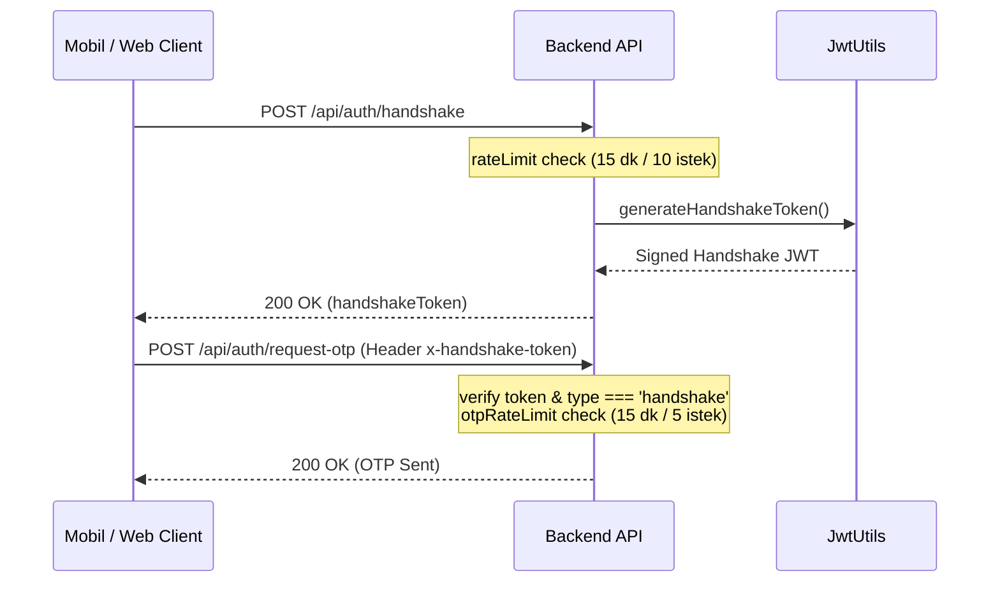

# Story 35: Backend Security Hardening

## 1. Problem Tanımı
Hoppa backend API'lerinin güvenliğini artırmak ve saldırılara (DDoS, spam, brute-force, web tabanlı güvenlik açıkları) karşı daha dayanıklı hale getirmek için aşağıdaki güvenlik iyileştirmelerinin yapılması hedeflenmektedir:
1. **Helmet Entegrasyonu:** HTTP güvenliği başlıklarının (Security Headers) eklenmesi.
2. **Global Rate Limiter:** IP bazlı istek sınırlaması uygulanarak genel DDoS/Spam ataklarının önlenmesi.
3. **Request Body Doğrulaması:** Zod şemalarıyla request body kontrollerinin middleware seviyesinde katılaştırılması.
4. **Handshake Token Mekanizması:** Kamuya açık kritik endpoint'lerin (örn: OTP talepleri) suistimal edilmesini zorlaştırmak amacıyla, istek öncesi kısa süreli imzalı bir handshake token kontrolü eklenmesi.

## 2. Teknik Tasarım

### 2.1. Helmet Entegrasyonu
* `backend/package.json` dosyasına `helmet` bağımlılığı eklenecek ve yüklenecektir.
* `backend/src/index.ts` dosyasına `app.use(helmet())` eklenerek HTTP güvenlik başlıkları devreye alınacaktır.

### 2.2. Global Rate Limiter
* `backend/src/middlewares/RateLimiter.ts` dosyasına tüm API rotalarını koruyacak `globalRateLimiter` eklenecektir.
* **Sınır:** IP başına 15 dakikada en fazla 300 istek (yaklaşık saniyede 0.33 istek ortalaması, normal bir kullanıcı için fazlasıyla yeterli).
* `backend/src/index.ts` dosyasına `app.use(globalRateLimiter)` eklenecektir.

### 2.3. Request Body Doğrulaması (Zod Middleware)
* Gelen request body'lerini doğrulamak için `backend/src/middlewares/ValidateMiddleware.ts` dosyası oluşturulacaktır.
* Bu middleware, verilen Zod şemasına göre `req.body`'yi parse edecek ve hata durumunda `400 Bad Request` ile Zod hata mesajlarını dönecektir.
* Örnek şemalar (`backend/src/types/schemas.ts`):
  * `requestOtpSchema`: `{ phone: z.string().min(10) }`
  * `verifyOtpSchema`: `{ phone: z.string().min(10), code: z.string().length(6) }`

### 2.4. Handshake Token Mekanizması
* `JwtUtils.ts` içine `generateHandshakeToken` metodu eklenecektir. Bu token 5 dakika geçerli olacak ve payload'unda `{ type: 'handshake' }` taşıyacaktır.
* **Yeni Rota:** `POST /api/auth/handshake` (kamuya açık, ancak rate limiter ile korumalı - 15 dakikada en fazla 10 istek).
* `backend/src/middlewares/HandshakeMiddleware.ts` adında yeni bir middleware yazılacaktır. Bu middleware, gelen isteklerin `x-handshake-token` header'ını doğrulayacaktır.
* `/api/auth/request-otp` ve `/api/couriers/apply` rotaları bu middleware ile korunacaktır.

---

## 3. Akış Şeması (OTP Talebi ve Handshake)

