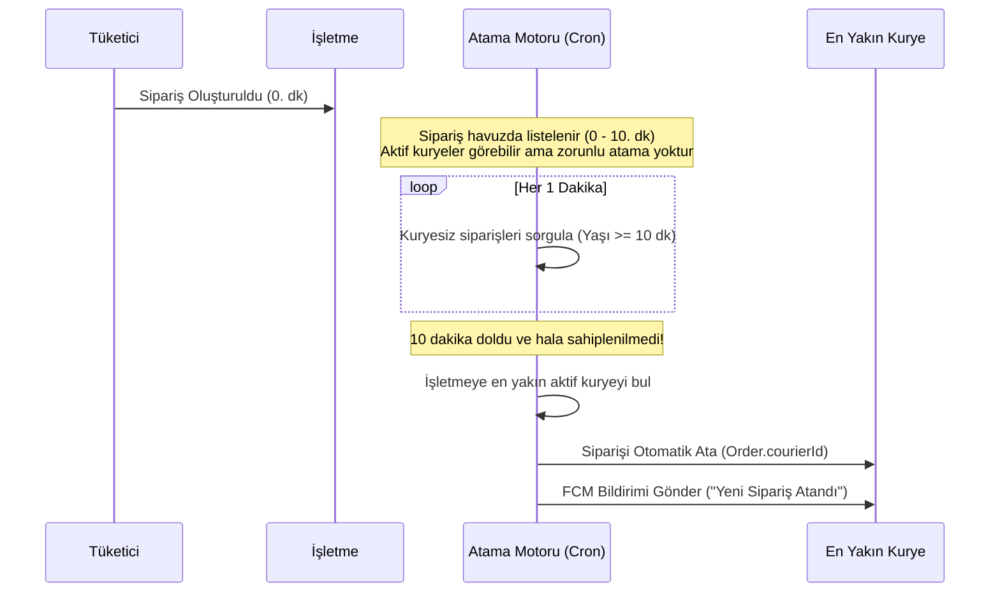

# Story 36: Courier Order Matching and Auto-Assignment Engine

## 1. Problem Tanımı ve Hedefler
Siparişlerin kuryelere hızlı ve verimli bir şekilde dağıtılması amacıyla akıllı bir atama motoru kurgulanacaktır:
1. **Havuz Modeli (İlk 10 Dakika):** Sipariş oluşturulduğunda veya hazırlanmaya başladığında, dükkanın konumuna en yakın aktif (nöbetteki) kuryelerin havuz ekranında listelenir. Kuryeler bu siparişi isteğe bağlı olarak sahiplenebilir.
2. **Otomatik Atama Modeli (10. Dakikadan Sonra):** Siparişin üzerinden 10 dakika geçmesine rağmen hiçbir kurye siparişi sahiplenmemişse, sistem otomatik olarak devreye girer. İşletmeye mesafe olarak en yakın, nöbetteki aktif kuryeyi bularak siparişi doğrudan bu kuryeye atar ve bildirim gönderir.

---

## 2. Teknik Tasarım

### 2.1. Mesafe Hesaplama Yöntemi (Haversine Formula)
PostgreSQL üzerinde coğrafi konumlar arasındaki kuş uçuşu mesafeyi (km) hesaplamak için veritabanı seviyesinde bir fonksiyon veya SQL seviyesinde Haversine formülü kullanılacaktır:
```sql
-- Haversine SQL sorgusu örneği (Prisma $queryRaw için):
-- 6371 * acos(cos(radians(shop.latitude)) * cos(radians(courier.latitude)) * cos(radians(courier.longitude) - radians(shop.longitude)) + sin(radians(shop.latitude)) * sin(radians(courier.latitude)))
```

### 2.2. Otomatik Atama Zamanlayıcısı (Cron Job)
* Sunucu tarafında her 1 dakikada bir çalışacak bir zamanlayıcı görev (cron job) tanımlanacaktır.
* Bu görev:
  1. `courierId` değeri `null` olan,
  2. Durumu `PENDING` veya `PREPARING` olan,
  3. Oluşturulma tarihi 10 dakikayı aşmış (`createdAt <= now - 10 minutes`) siparişleri sorgular.
  4. Her sipariş için:
     * Siparişin ait olduğu dükkanın (`shop`) konumunu alır.
     * O an nöbette olan (`isActive = true`), durumu `APPROVED` olan ve en son konumu (`CourierLocation`) dükkanın `deliveryRadiusKm` veya kuryenin `maxServiceDistanceKm` sınırları içinde olan aktif kuryeleri sorgular.
     * Bu kuryeler arasından mesafesi **en yakın** olan kuryeyi seçer.
     * Seçilen kuryeye siparişi otomatik atar (`Order.courierId = courier.id`).
     * Kuryeye Firebase Cloud Messaging (FCM) üzerinden "Yeni Sipariş Atandı" bildirimi gönderir.

---

## 3. Akış Şeması



---

## 4. Mimari Alternatifler ve Değerlendirmeler

### Alternatif A: Cron Job (Önerilen)
* **Nasıl Çalışır:** Her dakika veritabanı taranır ve zaman aşımına uğramış siparişler toplu olarak işlenir.
* **Avantajları:** Basit, ek altyapı (Redis vb.) gerektirmez, sunucu kesintilerinde veri kaybı yaşanmaz.
* **Dezavantajları:** Tam saniyesinde tetiklenmez, 1 dakikaya kadar sapma yaşanabilir (örneğin 10. dakikada değil, 10. dk 45. saniyede atanabilir). Ancak bu kabul edilebilir bir sapmadır.

### Alternatif B: Kuyruk Yönetimi (Queue - BullMQ)
* **Nasıl Çalışır:** Sipariş oluştuğunda Redis tabanlı bir kuyruğa 10 dakika gecikmeli (delay) bir iş eklenir.
* **Avantajları:** Tam 10. dakikada saniyesi saniyesine çalışır.
* **Dezavantajları:** Redis bağımlılığı yaratır, monorepo altyapısına ek yük getirir.
