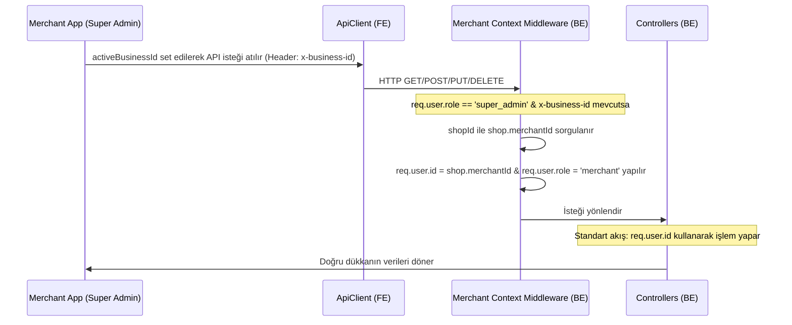

# 📊 Story 52: Süper Admin Market Seçimi Bağlam Sorunu Düzeltmesi (Super Admin Shop Selection Context Fix)

Bu döküman, Hoppa projesinde Süper Admin rolündeki bir kullanıcının esnaf panelindeki (Merchant App) sol menüden market/dükkan seçimi yaptığında, ekranlarda hâlâ eski seçili dükkana ait verilerin gösterilmesi ve işlemlerin gerçekleşmemesi hatasını gidermeye yönelik teknik tasarımı tanımlar.

---

## 🏛️ 1. İNCELEME & BULGULAR

1. **Frontend Tarafı (`merchant_main_layout.dart` & `providers/merchant_api_providers.dart`)**:
   * Süper Admin sol menüdeki dropdown'dan yeni bir dükkan seçtiğinde `selectedMerchantBusinessIdProvider` güncellenmektedir.
   * Ancak frontend'deki repository'ler (örneğin `MerchantProductRepository`, `MerchantOrderRepository`) `ApiClient` üzerinden HTTP istekleri atarken bu seçili dükkan bilgisini bir üst bilgi (Header) veya Query parametresi olarak sunucuya iletmemektedir.
   * `ApiClient` sınıfı ise bu dinamik değişen seçili dükkandan haberdar değildir.

2. **Backend Tarafı (`backend/src/controllers/...`)**:
   * `/api/merchant/...` altındaki tüm denetleyiciler (örneğin `ProductController`, `OrderController`, `ShopCampaignController`) işlemleri yürütürken istek atan kullanıcının `req.user.id` (esnaf ID'si) bilgisini baz alarak dükkanı sorgulamaktadır (`where: { merchantId: req.user.id }`).
   * Ancak Süper Admin bir esnaf olmadığı için onun `req.user.id`'sine bağlı bir dükkan bulunmamakta ya da sürekli ilk/varsayılan dükkan yüklenmektedir.

---

## 🛠️ 2. PLANLANAN ÇÖZÜM MİMARİSİ

Bu sorunu çözmek için en sade, sürdürülebilir ve etki alanı en dar mimari tercih edilmiştir:

### A. Frontend İyileştirmeleri
1. **`ApiClient` Sınıfı (`packages/core_network/lib/src/api_client.dart`)**:
   * Sınıf içine `String? activeBusinessId` adında dinamik bir alan eklenir.
   * `_buildHeaders` metodunda, eğer `activeBusinessId` set edilmişse, isteğe `x-business-id` header bilgisi eklenir.
2. **`MerchantMainLayout` (`apps/merchant_app/lib/apps/merchant/merchant_main_layout.dart`)**:
   * `_initData` ve dropdown `onChanged` tetiklendiğinde, `ref.read(apiClientProvider).activeBusinessId` değeri güncellenir.

### B. Backend İyileştirmeleri
1. **`merchantRoutes.ts` (`backend/src/routes/merchantRoutes.ts`)**:
   * Rotaların başına bir ara katman (middleware) eklenir.
   * Bu ara katman, istek atan kullanıcı bir `super_admin` ise ve istekte `x-business-id` header bilgisi varsa:
     * İlgili dükkanı (`Shop`) veritabanından sorgular.
     * Bulunursa, `req.user.id` değerini bu dükkanın `merchantId` değeri ile değiştirir.
     * `req.user.role` değerini `"merchant"` yapar.
   * Bu sayede tüm alt denetleyiciler (controllers) hiçbir değişikliğe uğramadan doğrudan seçilen dükkan üzerinde işlem yapar.

---

## 🧪 3. DOĞRULAMA PLANI

1. **Backend Statik Analiz**:
   * `npx tsc --noEmit` çalıştırılarak backend'in sorunsuz derlendiği doğrulanır.
2. **Frontend Statik Analiz**:
   * `flutter analyze` çalıştırılarak frontend'in temiz olduğu doğrulanır.
3. **Manuel Test**:
   * Süper Admin olarak giriş yapılır.
   * Farklı marketler sol menüden seçilerek ürünler, siparişler ve dashboard verilerinin anlık olarak seçilen markete göre güncellendiği teyit edilir.
