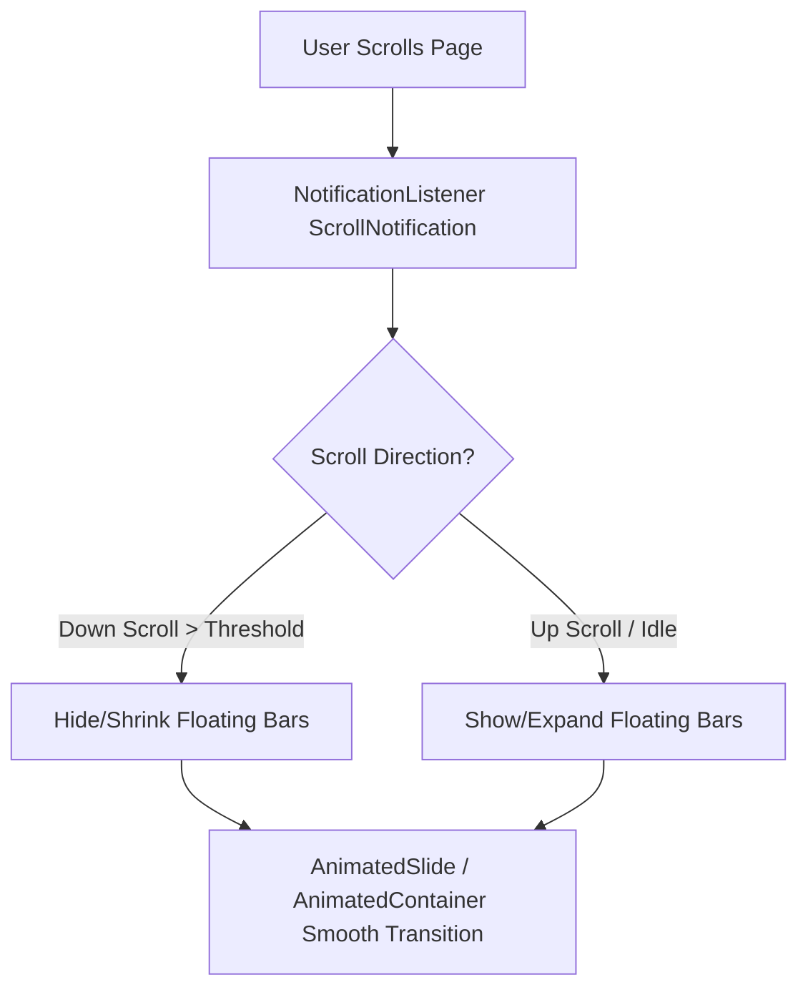

# Story 67: Yüzen Alt & Üst Menü Barı (Floating Navigation Dock & Floating Header Redesign)

## 📌 Genel Bakış ve Hedefler
Tüm modern mobil ve masaüstü işletim sistemlerinde (iOS 18+ Dynamic Dock, Android 15 Floating Pill, iPadOS/macOS floating navigation bars) benimsenen **Yüzen Menü Barı (Floating Bar)** tasarım trendine Hoppa uygulaması genelinde geçiş yapılacaktır.

Bu hikaye kapsamında:
1. **Alt Menü Barı (Floating Bottom Navigation Pill):** Ekran kenarlarından bağımsız yüzen (floating), oval radyanlı (`BorderRadius.circular(32)`), `BackdropFilter` cam efektli (Glassmorphism), yumuşak gölgeli ve kaydırma (scroll) durumuna duyarlı dinamik alt bar tasarımı.
2. **Üst Menü Barı (Floating Top Header):** Sayfa aşağı kaydırıldığında (scroll down) ekranın üstünde yüzen kompakt bir cam kapsüle (floating capsule) dönüşen, yukarı kaydırıldığında ise tam detaylı haline genişleyen akıllı üst menü barı.
3. **Akıcı Animasyonlar ve Mikro Etkileşimler:** `NotificationListener<ScrollNotification>` ile sıfır takılma ile scroll takibi, yaylı (spring/cubic-bezier) kaybolma/belirme ve aktif sekme neonu/indikatörü.

---

## 🎨 Designer Agent - UI/UX & Tasarım Spesifikasyonları

### 1. Alt Yüzen Bar (Floating Bottom Navigation Dock)
- **Konumlandırma:** `Bottom: 16dp`, `Left: 16dp`, `Right: 16dp` (Ekranın altından ve kenarlarından askıda durur).
- **Şekil ve Boyut:** Kapsül Formu (`BorderRadius.circular(36)`), Yükseklik: `68dp`.
- **Cam Efekti (Glassmorphism):**
  - `BackdropFilter`: `ImageFilter.blur(sigmaX: 18, sigmaY: 18)`
  - Arka Plan Rengi: `Colors.white.withOpacity(0.85)` (Aydınlık Mod) / Dark Mode için `Color(0xFF1E1E1E).withOpacity(0.85)`.
  - Kenarlık: `Border.all(color: Colors.white.withOpacity(0.4), width: 1.5)`
- **Yumuşak Gölge (Ambient Soft Shadow):**
  ```dart
  boxShadow: [
    BoxShadow(
      color: Colors.black.withOpacity(0.08),
      blurRadius: 24,
      spreadRadius: 2,
      offset: Offset(0, 10),
    ),
    BoxShadow(
      color: primaryColor.withOpacity(0.12),
      blurRadius: 16,
      spreadRadius: -4,
      offset: Offset(0, 6),
    ),
  ]
  ```
- **Aktif Sekme İndikatörü:** Seçili ikonun arkasında yumuşak renklendirilmiş kapsül ışığı (Neon Accent Pillow).
- **Hoppa! Orta Buton Entegrasyonu:** Merkezdeki özel `AnimatedHoppaButton` yüzen barın ortasına taşma/tümleşik olarak entegre edilecek, neonsal parlama efektleri korunacak.

### 2. Üst Yüzen Bar (Floating Top Header)
- **Durağan Durum (Top = 0):** Sayfa en üstteyken standart geniş ve ferah Hoppa başlığı (Konum seçici, arama barı, profil resmi).
- **Kaydırma Durumu (Scroll Down > 40px):**
  - Üst bar ekranın tepesinden ayrılarak `Top: 12dp`, `Left: 16dp`, `Right: 16dp` konumunda yüzen kompakt kapsüle dönüşür.
  - Arka planı `BackdropFilter` ile cam görünümü kazanır (`blur: 15`).
  - Konum bilgisi ve hızlı aksiyonlar (arama/profil) tek satırda zarifçe özetlenir.
- **Yukarı Kaydırma (Scroll Up / Stop):** Tam veya yüzen geniş moduna pürüzsüz geçiş yapar.

---

## ⚙️ Analyzer & Backend/Frontend Agent - Teknik Mimari

### 1. Scroll-Aware State & Animation Controller
Sistem genelinde scroll hareketlerinin performanslı ve reaktif takibi için `FloatingNavigationController` (Riverpod Provider veya Notification listener) kullanılacaktır:



- **Sıfır Lag (Performance):** Scroll takibi esnasında ağır `setState` çağrılarından kaçınmak için `ValueNotifier<bool>` veya Riverpod `StateController<bool>` ile sadece bar bileşenleri re-render edilecektir.
- **Scroll Clamping:** Sayfa en alta ulaştığında (overscroll) barın istemsizce kaybolması engellenecektir.

### 2. Bileşen Hiyerarşisi (Component Hierarchy)

```
apps/consumer_app/
├── lib/
│   ├── apps/
│   │   ├── consumer/
│   │   │   ├── main_layout/
│   │   │   │   ├── main_layout_page.dart (Yüzen alt bar düzeni)
│   │   │   │   ├── widgets/
│   │   │   │   │   ├── floating_bottom_bar.dart (YENİ - Yüzen Cam Kapsül Alt Bar)
│   │   │   │   │   ├── floating_top_header.dart (YENİ - Yüzen Cam Kapsül Üst Bar)
│   │   │   │   │   └── floating_nav_item.dart (YENİ - Micro-animated nav öğesi)
```

---

## 🧪 Doğrulama Protokolü

1. **Statik Analiz:** `flutter analyze` ile tüm paket ve uygulamaların sorunsuz geçtiği doğrulanacak.
2. **Ekran Uyumluluğu:** iOS Safe Area (Home Indicator) ve Android 15 Gesture Navigation çubuğu üstünde çakışma olmadan estetik floating marjin kontrol edilecek.
3. **Scroll Testi:** Hızlı ve yavaş kaydırmalarda takılma olmadan barın yumuşak açılıp kapanması doğrulanacak.
