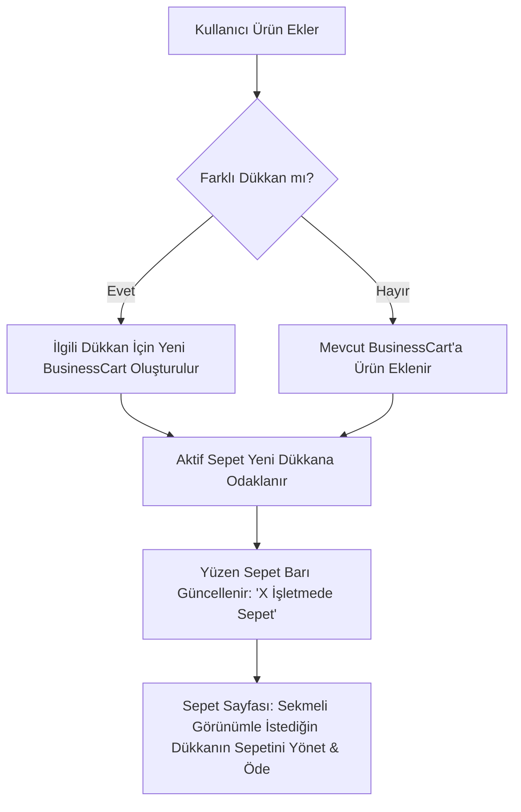

# Story 68: Multi-Merchant Cart Architecture & Management (Çoklu İşletme Sepeti Yönetimi)

## 🎯 Hedef ve Vizyon
Mevcut durumda Hoppa Tüketici Uygulaması (`consumer_app`), kullanıcının aynı anda yalnızca TEK BİR dükkandan/işletmeden sepetine ürün eklemesine izin veriyordu. Farklı bir dükkandan ürün eklenmeye çalışıldığında hata verilip sepetin tamamen temizlenmesi gerekiyordu.

Bu hikaye ile:
1. **Çoklu İşletme Sepeti Mimarisi (`Multi-Merchant Cart State`)** kurulacaktır. Kullanıcı aynı anda farklı işletmelerden sepet oluşturabilecek, hiçbir sepet ürünü kaybolmayacaktır.
2. **Aktif Sepet ve İşletme Seçici (`Business Cart Selector & Tabs`)**: Sepetim sayfasında üst kısımda dinamik sepet sekmeleri yer alacak; kullanıcı istediği dükkanın sepetine geçebilecek veya tek dokunuşla ilgili dükkanın sepetini ödemeye geçirebilecektir.
3. **Yüzen Sepet Barı Yeniliği (`FloatingCartCard Redesign`)**: Birden fazla işletmede ürün olduğunda ekranın altında "2 İşletmede Sepetiniz Var" rozeti ile şık, modern bir özet barı gösterilecektir.
4. **Sorunsuz Kullanıcı Deneyimi (Seamless UX & Micro-interactions)**: Mağazalar arası geçişlerde ve ürün eklemelerde engeller kalkacak, bilgi amaçlı bildirimler ile kullanıcı akışı desteklenecektir.

---

## 🏗️ Teknik Tasarım & Veri Yapısı

### 1. `BusinessCart` ve `CartState` Veri Modeli
`apps/consumer_app/lib/apps/consumer/cart/cart_provider.dart`:

```dart
class BusinessCart {
  final String businessId;
  final String businessName;
  final String? businessLogoUrl;
  final List<CartItem> items;

  BusinessCart({
    required this.businessId,
    required this.businessName,
    this.businessLogoUrl,
    required this.items,
  });

  double get subtotal => items.fold(0.0, (sum, i) => sum + (i.businessProduct.price * i.quantity));
  int get totalItemCount => items.fold(0, (sum, i) => sum + i.quantity.ceil());
}

class CartState {
  final Map<String, BusinessCart> carts; // businessId -> BusinessCart
  final String? activeBusinessId;       // Aktif incelenen/ödenen sepet

  BusinessCart? get activeCart => activeBusinessId != null ? carts[activeBusinessId] : (carts.isNotEmpty ? carts.values.first : null);
  List<CartItem> get items => activeCart?.items ?? [];
  String? get currentBusinessId => activeCart?.businessId;
  double get totalAmount => activeCart?.subtotal ?? 0.0;
  
  double get grandTotal => carts.values.fold(0.0, (sum, c) => sum + c.subtotal);
  int get totalItemCountAllCarts => carts.values.fold(0, (sum, c) => sum + c.totalItemCount);
  bool get hasMultipleCarts => carts.length > 1;
}
```

### 2. Akış Şeması (Flowchart)



---

## 🎨 UI/UX Değişiklikleri

1. **`CartPage` Sekmeli Üst Header**:
   - Birden fazla işletmede ürün varsa, sayfanın üstünde yatay kaydırılabilir dükkan sekmeleri (`[ 🏪 Migros Jet (3) - ₺180 ] [ ☕ Hoppa Kahve (2) - ₺95 ]`).
   - Sekme değiştirildiğinde sepet içeriği, minimum tutar çubuğu ve alt ödeme barı anında seçili dükkana göre güncellenir.
   - Her sekmede sadece o dükkanın sepetini silmeye imkan tanıyan silme butonu.

2. **`FloatingCartCard` (Yüzen Sepet Barı)**:
   - Tek dükkan sepetinde mevcut premium tasarım korunur.
   - Çoklu dükkan sepetinde işletme logoları üst üste (avatar stack) gösterilir, "2 İşletmede Sepet" rozeti ve toplam tutar ile "Sepetleri Gör" ikonu sunulur.

---

## 🧪 Doğrulama ve Test Protokolü
1. `flutter analyze` ile statik kod analiz testi.
2. Farklı işletmelerden sepet oluşturma ve sepetler arası geçiş testi.
3. Tekil sepet silme ve tüm sepetleri boşaltma testi.
4. Ödeme sayfasına seçili dükkanın sepetiyle geçiş testi.
