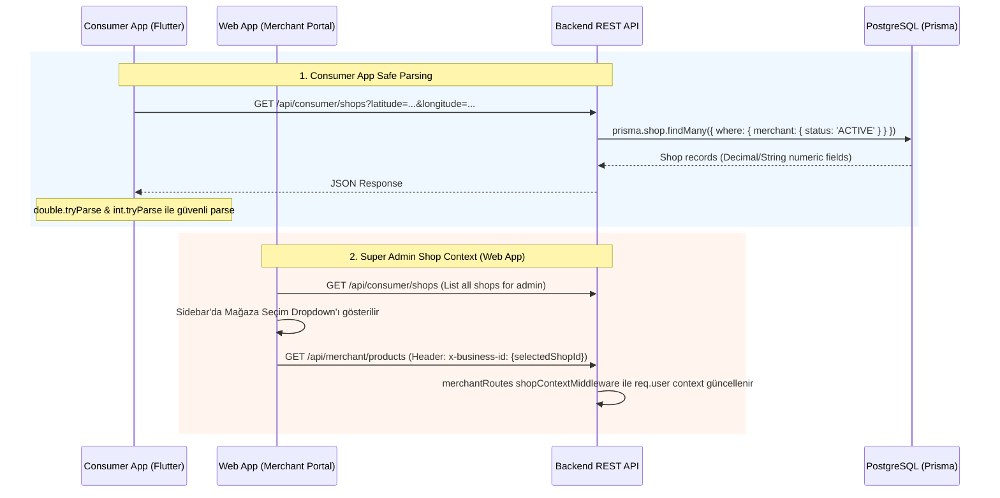

# 📊 Story 72: Tüketici İşletme Listesi Hatası, Süper Admin Dükkan Seçimi ve Web UI Temaları Düzeltmesi

Bu doküman; Tüketici uygulamasında (Consumer App) dükkan listesi yüklenirken oluşan tip dönüştürme hatasının giderilmesi, Satıcı Portalında (Web App) Admin/Süper Admin hesabı ile giriş yapıldığında işletme seçim dropdown'ının eklenmesi, gece teması stillerinin (dark mode bleed) input ve filtre çubuklarındaki bozulmalarının düzeltilmesi ve Kampanya & Reklam menüsü aktif sekme hatasının çözülmesini kapsar.

---

## 🏛️ 1. İNCELEME VE KÖK NEDEN ANALİZİ

### 1.1. Tüketici Uygulaması Dükkan Yükleme Hatası (Consumer App Merchant Listing Error)
* **Konum:** `apps/consumer_app/lib/apps/consumer/repositories/consumer_shop_repository.dart` ve `packages/core_shared/lib/shared/models/business.dart`.
* **Kök Neden:** `ConsumerShopRepository.getShops` içerisinde `deliveryRadiusKm`, `minBasketAmount`, `baseDeliveryFee`, `reviewCount` gibi numerik alanlar API yanıtından ayrıştırılırken `(json['deliveryRadiusKm'] as num)` gibi katı tür zorlamaları (type cast) kullanılmaktadır. Backend sorgusunda Decimal, String veya null döndüğünde Dart çalışma zamanında `TypeError: String is not a subtype of type num` hatası fırlamakta ve Riverpod `consumerShopsProvider` state'i hataya düşerek ekranda *"Dükkanlar yüklenirken bir hata oluştu. Lütfen tekrar deneyin."* uyarısı gösterilmektedir.

### 1.2. Satıcı Portalı Admin İşletme Seçim Dropdown'ı Eksikliği (Super Admin Shop Selection)
* **Konum:** `apps/web_app/src/components/merchant/MerchantLayout.tsx` ve `apps/web_app/src/utils/merchant-auth.ts`.
* **Kök Neden:** Backend `merchantRoutes.ts` Süper Admin isteklerinde `x-business-id` header bilgisini desteklemesine rağmen, Web Satıcı Portalında (`apps/web_app`) Admin kullanıcısı giriş yaptığında yan menüde (sidebar) dükkan seçimi için herhangi bir UI dropdown bileşeni bulunmamakta ve `merchantApiFetch` isteklerinde `x-business-id` header'ı gönderilmemektedir.

### 1.3. Web App Input ve Filtre Alanlarındaki Gece Teması Taşması (Dark Mode Bleed)
* **Konum:** `apps/web_app/tailwind.config.js`, `product-modal.tsx`, `catalog-import-modal.tsx`, `campaigns/index.tsx`, `dashboard/index.tsx`.
* **Kök Neden:** `apps/web_app/tailwind.config.js` konfigürasyon dosyasında `darkMode: 'class'` tanımı eksiktir. Bu nedenle Tailwind CSS varsayılan işletim sistemi temasına (`@media (prefers-color-scheme: dark)`) geçmekte ve kullanıcı web uygulamasında beyaz tema seçse dahi tarayıcı karanlık modda ise `dark:bg-slate-950` sınıfları input alanlarının arka planını siyaha çevirmektedir. Ayrıca bazı inputlarda `isDark` kontrolü yerine doğrudan `dark:` sınıfları kullanılmıştır.

### 1.4. Kampanya & Reklam Menüsü Tıklama Sorunu
* **Konum:** `apps/web_app/src/pages/merchant/campaigns/index.tsx`.
* **Kök Neden:** Kampanya sayfasında `<MerchantLayout title="..." activeTab="settings">` şeklinde yanlış bir `activeTab` prop'u iletilmiştir. Sayfadayken sol menüde "Mağaza Ayarları" aktif görünmekte ve "Kampanya & Reklam" linkine tıklandığında rota zaten `/merchant/campaigns` olduğu için menü aktifliği değişmemektedir.

---

## 🛠️ 2. TEKNİK ÇÖZÜM MİMARİSİ

---

## 🧪 3. DOĞRULAMA PLANLARI

1. **Backend & Frontend Statik Analizi:**
   * `npx tsc --noEmit` (backend) ve `npm run build` (apps/web_app) ile statik analiz doğrulaması.
2. **Flutter Statik Analiz:**
   * `flutter analyze` ile Flutter paket ve uygulamalarının hatasız olduğu teyit edilecek.
3. **Fonksiyonel Testler:**
   * Tüketici uygulamasında mağazaların sorunsuz listelendiği doğrulanacak.
   * Web Portalında Admin ile girilip mağaza seçimi yapıldığında ilgili mağazanın ürün ve performans verilerinin geldiği teyit edilecek.
   * Açık ve koyu temalarda tüm input alanları (satış fiyatı, indirim miktarı, filtre barı) test edilecek.
