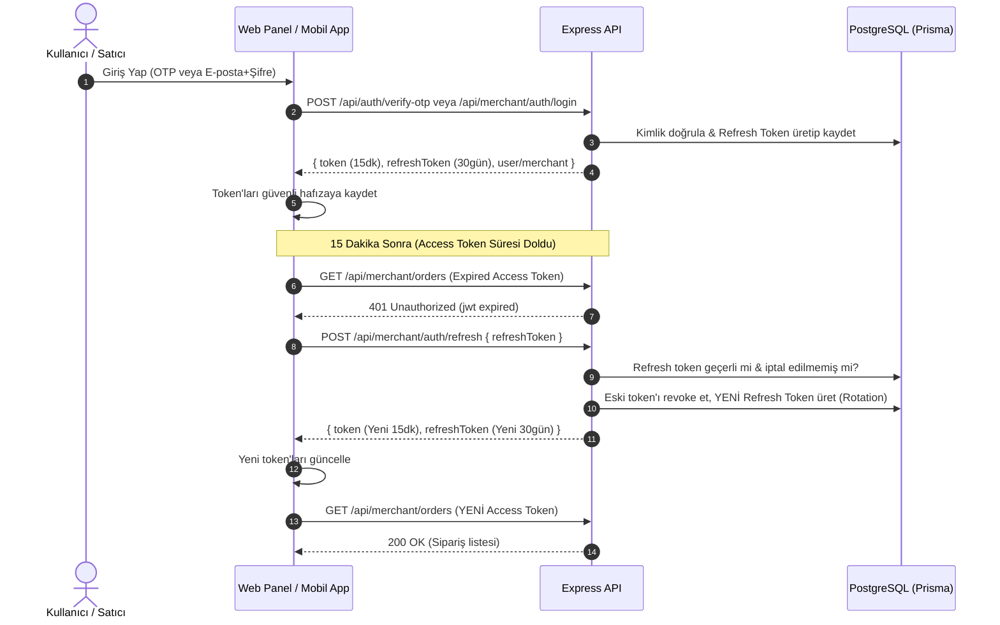

# Story 85: Kısa Süreli JWT ve Otomatik Refresh Token Mimarisi (Security Hardening)

## 1. Giriş ve Problem Tanımı
Mevcut mimaride kullanıcılar (Consumer, Courier, Admin) ve satıcılar (Merchant) için üretilen JWT token'larının geçerlilik süresi **7 gün** (`7d`) olarak belirlenmiştir. Tek bir uzun ömürlü token kullanımı:
- Çalınan veya sızan bir token'ın 7 gün boyunca yetkisiz erişim sağlamasına,
- Kullanıcı şifre değiştirdiğinde veya çıkış yaptığında token'ın sunucu tarafında anında geçersiz kılınamamasına,
- Güvenlik ve uyumluluk (OWASP, PCI-DSS) standartlarının ihlaline yol açmaktadır.

Bu hikaye ile **15 dakikalık kısa ömürlü Access Token** ve **30 günlük güvenli, veritabanı kontrollü & rotasyonlu (Token Rotation) Refresh Token** mimarisi kurulacaktır.

---

## 2. Mimari Tasarım ve Akış Şemaları

### 2.1. Token Tipleri ve Süreleri
| Token Tipi | Geçerlilik Süresi | Saklama Yeri | Görevi |
| :--- | :--- | :--- | :--- |
| **Access Token** | **15 Dakika** (`15m`) | Bellek / LocalStorage / SecureStorage | API isteklerinin yetkilendirilmesi |
| **Refresh Token** | **30 Gün** (`30d`) | DB (Hashed) & SecureStorage / LocalStorage | Süresi dolan Access Token'ı yenilemek |
| **Handshake Token** | **5 Dakika** (`5m`) | Bellek | OTP öncesi bot/spam koruması |

### 2.2. Oturum Açma ve Token Yenileme Akışı (Sequence Diagram)


---

## 3. Veritabanı Şeması (`schema.prisma`)

```prisma
model RefreshToken {
  id          String    @id @default(uuid())
  tokenHash   String    @unique
  userId      String?
  user        User?     @relation(fields: [userId], references: [id], onDelete: Cascade)
  merchantId  String?
  merchant    Merchant? @relation(fields: [merchantId], references: [id], onDelete: Cascade)
  expiresAt   DateTime
  createdAt   DateTime  @default(now())
  revokedAt   DateTime?
  replacedBy  String?
  deviceInfo  String?

  @@index([userId])
  @@index([merchantId])
  @@index([tokenHash])
}
```

---

## 4. Backend API Değişiklikleri

1. **`JwtUtils.ts`**:
   - `JWT_ACCESS_EXPIRES_IN = "15m"`
   - `JWT_REFRESH_EXPIRES_IN = "30d"`
   - `generateAccessToken(userId, role)`
   - `generateRefreshToken(userId, role, tokenId)`
   - `verifyRefreshToken(token)`
2. **`AuthController.ts`**:
   - `verifyOtp`: Access Token + Refresh Token dönecek ve DB'ye kaydedecek.
   - `refreshToken`: `POST /api/auth/refresh` endpoint'i.
   - `logout`: `POST /api/auth/logout` endpoint'i.
3. **`MerchantAuthController.ts`**:
   - `login`: Access Token + Refresh Token dönecek ve DB'ye kaydedecek.
   - `refreshToken`: `POST /api/merchant/auth/refresh` endpoint'i.
   - `logout`: `POST /api/merchant/auth/logout` endpoint'i.

---

## 5. İstemci (Frontend & Mobile) Entegrasyonu

1. **Web Satıcı Paneli (`apps/web_app`)**:
   - `merchant-auth.ts`: `merchantApiFetch` içinde 401 alındığında arka planda `POST /api/merchant/auth/refresh` çağrılıp yeni token alınacak ve istek kullanıcıya hissettirilmeden tekrarlanacak (Silent Refresh).
2. **Mobil Uygulamalar (`packages/core_network` & `packages/core_auth`)**:
   - `ApiClient`: 401 durumunda otomatik refresh denemesi yapılacak.
   - `AuthRepository`: `refreshToken`'ı `FlutterSecureStorage` içinde saklayacak.

---

## 6. Güvenlik ve Token Rotasyonu (Reuse Detection)
- Her refresh isteğinde eski refresh token tüketilir (`revokedAt = now()`) ve yenisi üretilir.
- Eğer önceden revoke edilmiş bir token tekrar sunulursa, sistem **Token Çalınması (Token Theft)** şüphesiyle ilgili kullanıcının tüm aktif refresh token'larını iptal eder ve yeniden giriş yapmasını zorunlu kılar.
