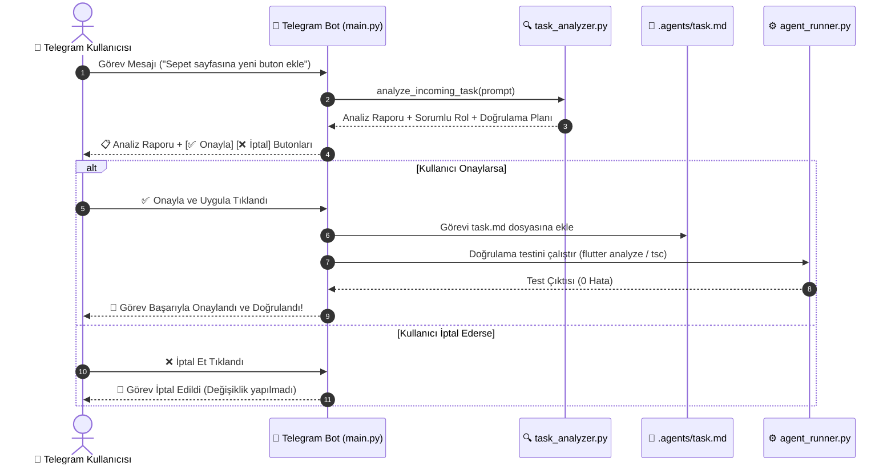

# Story 89: Hoppa Remote Agent Bridge (Telegram Bot Kontrol Arayüzü)

## 📌 Genel Bakış ve Amaç
Hoppa projesinin uzaktan yönetilebilmesi, terminal komutlarının ve geliştirme/doğrulama adımlarının (Flutter analizi, backend TypeScript derlemesi, web app derlemesi, Prisma şema kontrolleri, Git logları ve genel proje durumunun) güvenli bir Telegram Bot köprüsü üzerinden yürütülebilmesi için `agent-remote-bridge` modülü kurulmuştur.

---

## 🏗️ Mimari Yapı

```
agent-remote-bridge/
├── venv/                 # Python 3.12 Sanal Ortamı
├── .env                  # Telegram Bot Token ve Yetkili Kullanıcı Ayarları
├── .env.example          # Örnek Çevre Değişkenleri Şablonu
├── .gitignore            # venv/ ve hassas dosyaları git dışı bırakma
├── config.py             # Pydantic Settings tabanlı konfigürasyon yönetimi
├── security.py           # Whitelist / Allowed User ID güvenlik katmanı ve dekoratör
├── task_analyzer.py      # Görev etki analizi, sorumlu rol tespiti ve onay planı üretici
├── agent_runner.py       # Asenkron terminal/görev çalıştırıcı & çıktı biçimlendirici
├── main.py               # python-telegram-bot olay döngüsü, komutlar ve buton menüleri
└── README.md             # Kullanım ve kurulum kılavuzu
```

---

## 🔄 Analiz ve Kullanıcı Onay Döngüsü (Analyze & Approval Workflow)



---

## 🔐 Güvenlik Modeli (`security.py`)
1. **Kullanıcı Beyaz Listesi (Allowed User ID Whitelist):**
   - Yalnızca `.env` dosyasında tanımlanan `ALLOWED_USER_ID` (veya virgülle ayrılmış ID'ler) bota erişebilir.
   - Tanımlı olmayan kullanıcılardan gelen tüm mesaj ve komutlar derhal engellenir, konsola uyarı logu düşülür ve kullanıcıya erişim reddi mesajı gönderilir.
2. **Hassas Bilgi Maskeleme:**
   - Bot çıktılarında token ve şifrelerin istemeden açığa çıkması önlenir.
3. **Zaman Aşımı Koruması (Command Timeout):**
   - Sonsuz döngüye giren veya yanıt vermeyen terminal komutları varsayılan 300 saniye sonra güvenli bir şekilde sonlandırılır.

---

## ⚡ Temel Bot Komutları ve Özellikleri

| Komut | Açıklama |
| :--- | :--- |
| `/start` | Hoppa Bridge kontrol paneline hoş geldiniz mesajı ve interaktif buton menüsü. |
| `/help` | Kullanılabilir tüm komutların ve kullanım örneklerinin listesi. |
| `/status` | Proje çalışma dizini, Git dalı, sistem kaynağı ve araç versiyonları (Node, Flutter, Python). |
| `/flutter_analyze` | Hoppa monorepo genelinde `flutter analyze` çalıştırır ve sonucu raporlar. |
| `/backend_check` | `backend/` dizininde `npx tsc --noEmit` ile TypeScript tip kontrolü yapar. |
| `/web_build` | `apps/web_app/` dizininde `npm run build` ile Next.js derleme kontrolü yapar. |
| `/prisma_check` | `backend/` dizininde Prisma şemasını ve durumunu denetler. |
| `/git_status` | Projedeki değiştirilen dosyaları ve son commit özetini listeler. |
| `/run <komut>` | Hoppa çalışma dizininde özel bir terminal komutu çalıştırır (örn: `/run git pull`). |
| `Metin Mesajı` | Gönderilen her istek önce analiz edilir, plan Telegram'a sunulur; onaylanınca `.agents/task.md` ve doğrulama süreçleri işletilir. |

---

## 🚀 Çalıştırma Adımları

1. Sanal ortamı aktif edin:
   ```powershell
   agent-remote-bridge\venv\Scripts\activate
   ```
2. `.env` dosyasına bot token ve chat ID bilginizi yazın:
   ```env
   TELEGRAM_BOT_TOKEN="BOT_TOKEN_BURAYA"
   ALLOWED_USER_ID=123456789
   AGENT_WORKING_DIR="c:/Users/tunah/Sources/Hoppa/hoppa"
   ```
3. Köprüyü başlatın:
   ```powershell
   python main.py
   ```
4. Konsolda `[INIT] Remote Agent Bridge dinleniyor...` çıktısını gördüğünüzde Telegram botunuz canlıdır.
