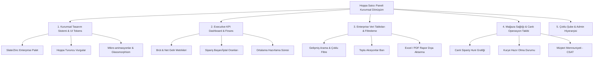

# Story 90: Web Satıcı Paneli Kurumsal & Enterprise Dönüşüm İyileştirme Planı

## 📌 Genel Bakış
Bu hikaye, Hoppa Web Satıcı Paneli'nin (`apps/web_app`) kurumsal düzeyde (enterprise-grade), modern, yüksek güven veren ve operasyonel verimliliği maksimize eden bir arayüz tasarım sistemine dönüştürülmesini hedefler.

---

## 🎯 Kurumsal Dönüşümün Temel Sütunları

---

## 🏛️ 1. Kurumsal Tasarım Sistemi & UI Standartları

### 1.1. Renk Hiyerarşisi & Kurumsal Palet
* **Arka Plan & Yüzeyler:**
  - *Light Mode:* Derin beyaz (`#FFFFFF`), nötr slate paneller (`#F8FAFC`, `#F1F5F9`), ultra ince kurumsal kenarlıklar (`border-slate-200/70`).
  - *Dark Mode:* Lüks grafit (`#0B0F17`), kurumsal kart yüzeyleri (`#111827`, `#1E293B`), ince cam kenarlıklar (`border-slate-800/80`).
* **Marka Vurgusu (Primary Accent):**
  - Hoppa Turuncusu (`#FF6B00` & `#EA580C`) yalnızca kritik aksiyon butonlarında, aktif sekmelerde ve kilit rozetlerde kullanılarak kurumsal ciddiyet korunur.
* **Finansal & Durum Renkleri:**
  - *Pozitif / Kazanç:* Zümrüt Yeşili (`#10B981` / Emerald).
  - *Kritik / İptal:* Yumuşak Yakut (`#F43F5E` / Rose).
  - *Beklemede / Hazırlanıyor:* Kehribar Sarısı (`#F59E0B` / Amber).
  - *Bilgi / Operasyon:* Kurumsal İndigo (`#6366F1`).

### 1.2. Tipografi & Hiyerarşi
* Yazı Tipi: **Plus Jakarta Sans** (Modern, geometrik, kurumsal).
* Sayısal ve Finansal Göstergeler: Tabular/Monospace rakam desteği (`font-mono` / `tabular-nums`) ile finansal hizalama.

---

## 📊 2. Executive KPI Dashboard & Finansal Yönetim

### 2.1. Üst Seviye Yönetici Kartları (Executive Metric Cards)
1. **Günlük & Aylık Net Ciro:**
   - Önceki döneme göre % artış/azalış trend göstergesi (Sparkline mini grafik).
2. **Aktif Sipariş Hacmi:**
   - Hazırlanan, yolda olan ve teslim edilen siparişlerin canlı durum sayaçları.
3. **Mağaza Verimlilik Skoru:**
   - Sipariş kabul süresi (< 2 dk hedefi) ve ortalama hazırlama süresi (dakika bazlı).
4. **Müşteri Memnuniyet Oranı:**
   - 5 üzerinden ortalama puan ve son 24 saatteki olumlu/olumsuz geri bildirimler.

---

## 📋 3. Enterprise Veri Tabloları (Data Grids) & Liste Tasarımı

### 3.1. Ürün & Sipariş Yönetim Ekranları
* **Zebra Çizgisiz, Yumuşak Satırlar:** Satır üzerine gelindiğinde (hover) yumuşak `bg-slate-500/5` arka planı ve satır sağında beliren hızlı işlem menüsü (Düzenle, Kopyala, Pasife Al).
* **Canlı Durum Rozetleri (Status Badges with Pulse Dots):**
  - Siparişlerde canlı yanıp sönen yeşil/sarı noktalar (`animate-pulse`).
* **Kompakt / Geniş Görünüm Anahtarı:** Yoğun çalışan işletmeler için satır yüksekliği ayarı (Dense / Comfortable).

---

## 🛡️ 4. Güvenlik, Çoklu Şube & Admin Yönetimi

* **Admin & Şube Değiştirici Barı:** Üst çubukta kurumsal şirket adı, aktif seçili şube ve hızlı şube geçiş menüsü.
* **Yetki Rozetleri:** Süper Admin, Mağaza Müdürü, Kasiyer/Mutfak personeli için rol tabanlı erişim kısıtlamaları.

---

## 🚀 5. Uygulama Adımları & Yapılacaklar Listesi

1. [ ] `MerchantLayout.tsx`: Kurumsal üst başlık, çoklu şube başlığı ve kurumsal sidebar tipografisinin güncellenmesi.
2. [ ] `dashboard/index.tsx`: Executive KPI kartları, finansal sparkline grafikleri ve canlı sipariş sayaçlarının entegrasyonu.
3. [ ] `orders/index.tsx`: Kurumsal sipariş yönetim tablosu, filtreleme barları ve canlı durum rozetlerinin modernleştirilmesi.
4. [ ] `products/index.tsx`: Ürün listeleme tablosu, stok uyarıları ve toplu işlem çubuğunun kurumsal standartlara yükseltilmesi.
5. [ ] `globals.css`: Kurumsal gölgeler, tablo geçişleri ve kurumsal scrollbar stillerinin tanımlanması.
6. [ ] Derleme doğrulaması: `npm run build` ile 0 hata kontrolü.
